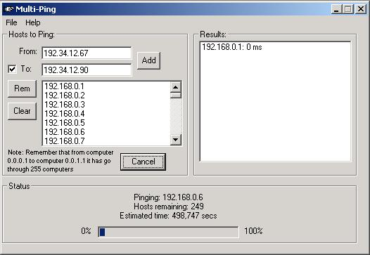



## Multi Ping v0\.3 beta

### Description

Multi-Ping is a simple ping program that can scan an entire network just by setting the starting computer and the final, *FULLY CODED*, it has stats and it's fast and simple (i guess ^_^) Check it out! Please criticise my code. And sorry about the bad english - i'm portuguese =)
 
### More Info
 

             |
---                |---
**Submitted On**   |2001-07-21 20:44:40
**By**             |[Tiago Cogumbreiro](https://github.com/Planet-Source-Code/PSCIndex/blob/master/ByAuthor/tiago-cogumbreiro.md)
**Level**          |Intermediate
**User Rating**    |5.0 (25 globes from 5 users)
**Compatibility**  |VB 6\.0
**Category**       |[Internet/ HTML](https://github.com/Planet-Source-Code/PSCIndex/blob/master/ByCategory/internet-html__1-34.md)
**World**          |[Visual Basic](https://github.com/Planet-Source-Code/PSCIndex/blob/master/ByWorld/visual-basic.md)
**Archive File**   |[Multi Ping232267212001\.zip](https://github.com/Planet-Source-Code/tiago-cogumbreiro-multi-ping-v0-3-beta__1-25306/archive/master.zip)

